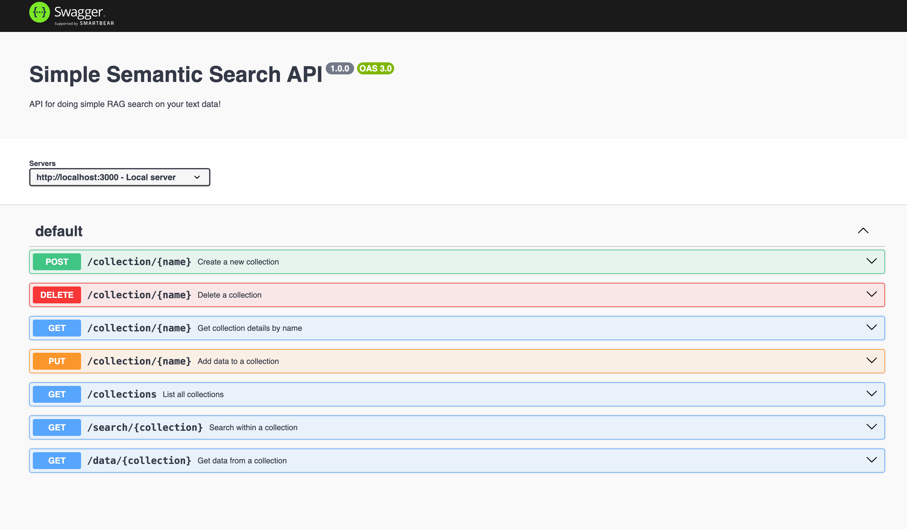

# Semantic Search API

**The absolute SIMPLEST way to add semantic search to your product**



## Overview

Semantic Search API is an open-source solution that allows you to integrate powerful semantic search capabilities into your product effortlessly. It's like an open-source version of Algolia but with the added power of semantic understanding.

## Key Features

- **Easy Setup**: Get started with just one command.
- **Powerful Search**: Leverage semantic search to deliver more relevant results.
- **Customizable**: Tailor the search to your specific needs.
- **Scalable**: Built to handle growing datasets efficiently.
- **Open Source**: Completely free and open-source.

## Quick Start

### Prerequisites

- Docker installed on your machine.

### Installation

### Installation

1. **Clone the Repository**:

```bash
git clone https://github.com/your-repo/semantic-search-api.git
cd semantic-search-api
```

2. **Copy Environment Variables**:

```bash
cp .env.example .env
```

Edit the `.env` file to set your configuration:

```dotenv
PORT=3001
WEAVIATE_SCHEME=http
WEAVIATE_HOST=0.0.0.0
WEAVIATE_PORT=8080
OPENAI_API_KEY=sk-your-api-key
DEFAULT_VECTORIZER_MODULE='text2vec-openai'
```

3. **Start the API**:

```bash
docker-compose up
```

That's it! Your semantic search API is now running.

### Usage

### Usage

#### Adding a Collection

To create a new collection, send a `POST` request to `/collection/:name`.

```bash
curl -X POST http://localhost:3000/collection/my-collection
```

#### Deleting a Collection
To delete a collection, send a DELETE request to /collection/:name.

```bash
curl -X DELETE http://localhost:3000/collection/my-collection
```

#### Listing Collections
To list all collections, send a GET request to /collections.

```bash
curl http://localhost:3000/collections
```

#### Adding Data to a Collection
To add data to a collection, send a PUT request to /collection/:name with the data in the request body.

```bash
curl -X PUT http://localhost:3000/collection/my-collection -H "Content-Type: application/json" -d '{"data": "Your data here"}'
```

#### Searching a Collection
To perform a search, send a GET request to /search/:collection with your search term as a query parameter.

```bash 
curl http://localhost:3000/search/my-collection?search=term
```

#### Advanced Configuration
Environment Variables
You can configure the API using the following environment variables:

PORT: Port on which the API runs (default: 3000).
Customization
Feel free to explore and customize the code to fit your needs. The API is designed to be flexible and easily extendable.

#### Contributing
We welcome contributions! Please see our CONTRIBUTING.md for more details on how to get involved.

#### License
This project is licensed under the MIT License - see the LICENSE file for details.

#### Support
For support or questions, please open an issue in this repository or reach out to us at support@yourdomain.com.